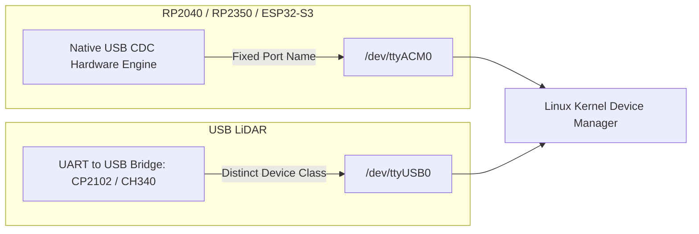
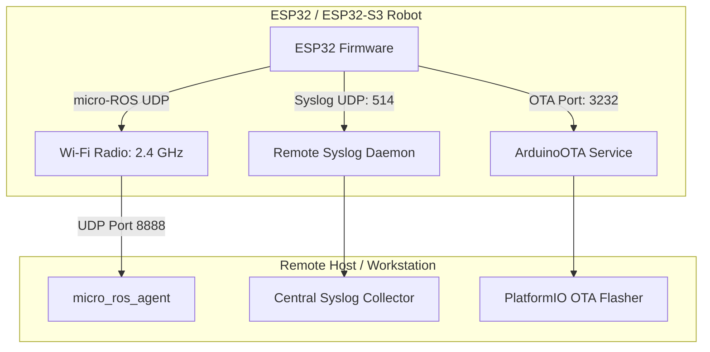
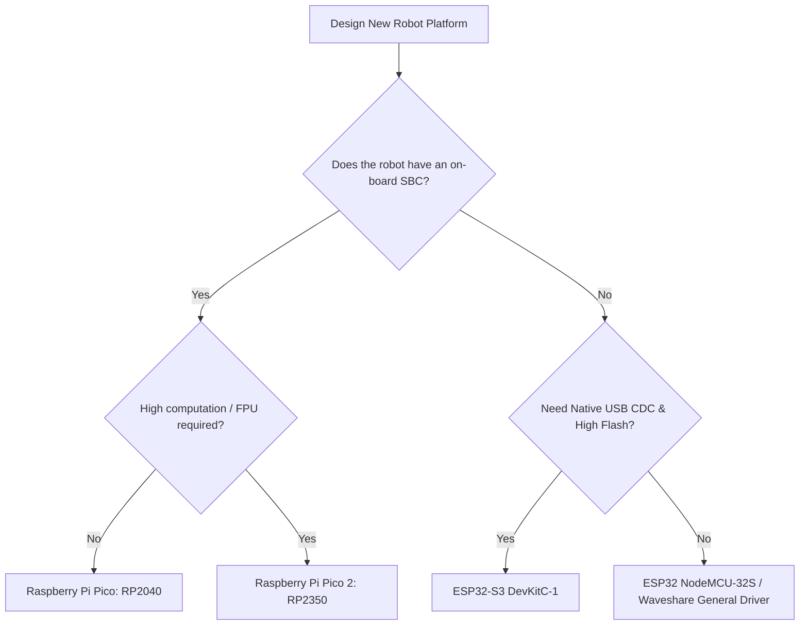

# Microcontroller Selection Guide

Choosing the right microcontroller unit (MCU) is the first critical architectural decision when designing a custom robot based on Linorobot2. The MCU runs the micro-ROS client firmware, samples encoders, executes the PID velocity controller, communicates with IMU and range sensors, and transmits odometry data back to the ROS 2 host computer.

---

## 1. Microcontroller Comparison Matrix

| Microcontroller | Architecture | Clock Speed | RAM / Flash | Native USB CDC | Wi-Fi Transport | Recommended Role |
| :--- | :--- | :---: | :---: | :---: | :---: | :--- |
| **Raspberry Pi Pico (RP2040)** | Dual ARM Cortex-M0+ | 133 MHz | 264 KB / 2 MB | Yes (`/dev/ttyACM0`) | No | **Recommended for Starter Serial Bots** with on-board SBC |
| **Raspberry Pi Pico 2 (RP2350)** | Dual ARM Cortex-M33 (FPU) | 150 MHz | 520 KB / 4 MB | Yes (`/dev/ttyACM0`) | No | **Recommended for High-Performance Serial Bots** |
| **ESP32 DevKit (NodeMCU-32S)** | Dual Xtensa LX6 | 240 MHz | 320 KB / 4 MB | CP2102/CH340 (`/dev/ttyUSBx`) | Yes (802.11 b/g/n) | **Recommended for Headless Wi-Fi Bots** |
| **ESP32-S3 (DevKitC-1)** | Dual Xtensa LX7 (Vector Ext) | 240 MHz | 512 KB / 8 MB | Yes (`/dev/ttyACM0`) | Yes (802.11 b/g/n) | **Recommended for Advanced Wi-Fi / OTA Bots** |
| **ESP32-S2 (Saola-1)** | Single Xtensa LX7 | 240 MHz | 320 KB / 4 MB | Yes (`/dev/ttyACM0`) | Yes (802.11 b/g/n) | Entry-level Single Core Wi-Fi Controller |
| **Teensy 4.0 / 4.1 (i.MX RT1062)** | ARM Cortex-M7 | 600 MHz | 1 MB / 8 MB | Yes (`/dev/ttyACM0`) | No (Ethernet on 4.1) | *Legacy Target* (Newlib GCC deprecation on Jazzy+) |

---

## 2. Serial Transport: Why Native USB CDC Matters

When connecting an MCU directly to an on-board single-board computer (such as a Raspberry Pi 4/5, Jetson Orin Nano, or x86 mini PC) via USB:

### Key Advantages of Native USB CDC (`/dev/ttyACM0`):
1. **Zero Device Name Collisions**: Most low-cost USB LiDARs (such as RPLiDAR A1/A2, LD19, YDLIDAR) use UART-to-USB bridge ICs (CP2102, CH340, FT232R) that register as `/dev/ttyUSB0` or `/dev/ttyUSB1`.
   - If your MCU also uses a USB-to-UART bridge (like classic ESP32 DevKits), Linux port assignment order determines which device becomes `/dev/ttyUSB0` and `/dev/ttyUSB1`, causing bringup scripts to fail upon reboot.
   - Microcontrollers with **native USB CDC** (Pico, Pico 2, ESP32-S3) always appear as `/dev/ttyACM0`, guaranteeing clean separation without complex `udev` symlinks.
2. **Deterministic High-Speed Bandwidth**: USB CDC handles micro-ROS framing buffers efficiently with negligible CPU overhead compared to standard UART bridges.

---

## 3. Wi-Fi Transport: Headless Robot Architectures

If your robot platform does not carry an on-board SBC and instead connects over local Wi-Fi directly to a remote workstation or cloud instance running the `micro_ros_agent`:

### Best Practices for Wi-Fi Deployments:
- **Use ESP32 or ESP32-S3**: Ensure the 2.4 GHz Wi-Fi signal is unobstructed by metal chassis plates.
- **Enable Remote Syslog**: Configure `#define SYSLOG_SERVER` to monitor runtime errors, packet loss, and voltage warnings in real-time.
- **Enable ArduinoOTA**: Update firmware over the air without having to physically open the robot shell or connect USB cables.

---

## 4. Selection Flowchart

