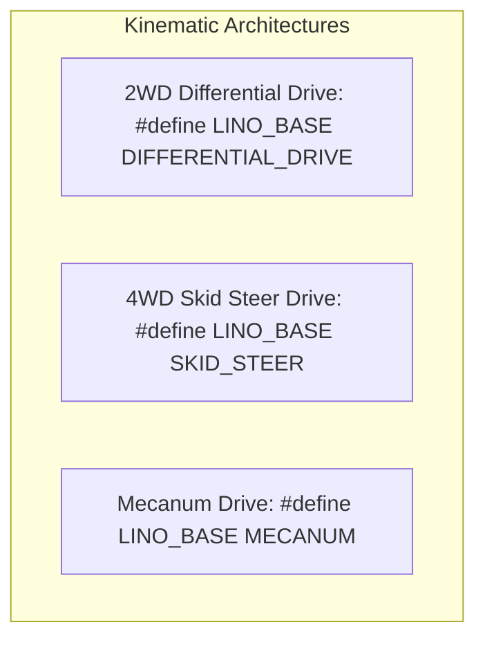
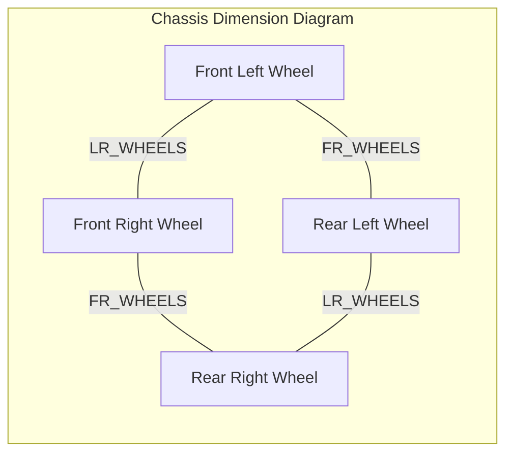

# Kinematics & Motor Sizing Guide

This chapter covers base kinematics, wheel geometry definitions, motor velocity calculations, and encoder counts per revolution (CPR) formulas for Linorobot2.

---

## 1. Supported Base Kinematic Types

Linorobot2 supports three fundamental wheeled kinematic models configured in `config/custom/<robot_name>_config.h`:



### Kinematics Comparison Matrix

| Drive Type | Minimum Motors | Degree of Freedom | Holonomic? | Wheel Orientation Rules |
| :--- | :---: | :---: | :---: | :--- |
| **2WD Differential Drive** | 2 Motors + 1/2 Casters | 2 ($v_x, \omega_z$) | No (Non-holonomic) | Standard parallel rubber wheels |
| **4WD Skid Steer Drive** | 4 Motors (or 2 linked pairs) | 2 ($v_x, \omega_z$) | No (Non-holonomic) | 4 parallel high-grip wheels |
| **Mecanum Drive** | 4 Independent Motors | 3 ($v_x, v_y, \omega_z$) | **Yes (Holonomic)** | 45° rollers oriented in 'O-shape' pattern |

> [!IMPORTANT]
> **Mecanum Roller Orientation**: When viewed from top-down, the rollers touching the ground must form an **'O-shape'** (or 'X-shape' on the upper surface). Inverting roller orientations will cause strafing commands ($v_y$) to result in rotational spin instead of sideways translation.

---

## 2. Geometry Parameters

The robot dimensions are defined in meters inside the config header:

```cpp
#define WHEEL_DIAMETER 0.065      // Wheel diameter in meters (e.g. 65mm = 0.065)
#define LR_WHEELS      0.150      // Distance between left and right wheel contact points (Track Width)
#define FR_WHEELS      0.170      // Distance between front and rear axles (Wheelbase, for 4WD & Mecanum)
```



---

## 3. Motor Sizing & Velocity Calculations

### 1. Maximum Wheel Speed & Linear Velocity

Given rated motor RPM at operating voltage and wheel diameter $D$ (in meters):

$$v_{max} = \frac{\text{RPM} \times \pi \times D}{60} \quad (\text{m/s})$$

#### Example Calculation:
For a 12V 200 RPM motor with a 65mm ($0.065\text{ m}$) wheel:
$$v_{max} = \frac{200 \times 3.14159 \times 0.065}{60} = \frac{40.84}{60} \approx 0.68\text{ m/s}$$

### 2. Maximum Angular Velocity

For a 2WD differential robot with track width $L = \text{LR\_WHEELS}$:

$$\omega_{max} = \frac{2 \times v_{max}}{L} \quad (\text{rad/s})$$

For $v_{max} = 0.68\text{ m/s}$ and $L = 0.15\text{ m}$:
$$\omega_{max} = \frac{2 \times 0.68}{0.15} \approx 9.07\text{ rad/s}$$

---

## 4. Encoder Counts Per Revolution (CPR) Formula

Linorobot2 firmware measures motor speed via quadrature encoder ticks sampled on both channels ($A$ and $B$) with 4x decoding.

$$\text{Total CPR} = \text{Encoder PPR (Pulses Per Revolution)} \times 4 \times \text{Gearbox Ratio}$$

```cpp
// Example: 11 PPR magnetic encoder with 1:30 gearbox reduction:
// Total CPR = 11 * 4 * 30 = 1320
#define COUNTS_PER_REV1 1320
#define COUNTS_PER_REV2 1320
#define COUNTS_PER_REV3 1320
#define COUNTS_PER_REV4 1320
```

> [!TIP]
> **Measuring CPR Empirically**:
> If the gear ratio or PPR is unknown, flash `test_sensors` or `firmware.ino`, manually rotate the wheel exactly 10 full revolutions by hand, and divide the logged total tick difference by 10.

---

## 5. PID Headroom Margin (`MAX_RPM_RATIO`)

```cpp
#define MOTOR_MAX_RPM 200         // Motor rated RPM under load
#define MAX_RPM_RATIO 0.85        // Reserve 15% power for PID feedback headroom
```

### Why `MAX_RPM_RATIO = 0.85` is Essential:
1. **Battery Voltage Sag**: When the battery drops from 12.6V (fully charged) to 11.1V (nominal), maximum unloaded motor RPM decreases proportionally.
2. **Turning Torque Compensation**: During high-speed turns, the PID controller must spin the outer wheel faster than average; without 15% headroom, PWM saturates at 100%, causing navigation trajectory deviation.
