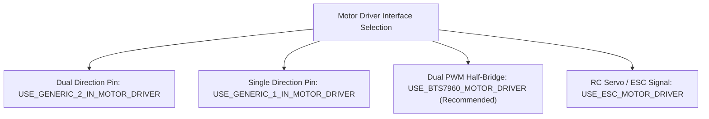

# Motor Drivers & Wiring Guide

Linorobot2 supports the four most common DC motor driver interfaces in the robotics industry. This guide covers wiring schematics, driver macro selection, and inversion parameters.

---

## 1. Supported Motor Driver Types



---

## 2. Driver Interface Details & Schematics

### 1. BTS7960 / IBT-2 High-Power Driver (`USE_BTS7960_MOTOR_DRIVER`)
*Recommended for medium to heavy mobile robots (up to 43A peak current per channel).*

```cpp
#define USE_BTS7960_MOTOR_DRIVER

#define MOTOR1_PWM_R 14     // Forward PWM
#define MOTOR1_PWM_L 15     // Reverse PWM
#define MOTOR1_EN    13     // Enable Pin (or tie R_EN + L_EN directly to 3.3V/5V)
```

```mermaid
flowchart LR
    subgraph MCU_Pins ["Microcontroller Pins"]
        P1["PWM_R Pin"]
        P2["PWM_L Pin"]
        P3["Enable Pin (Optional)"]
    end

    subgraph BTS7960 ["BTS7960 (IBT-2) Module"]
        P1 --> RPWM["RPWM Input"]
        P2 --> LPWM["LPWM Input"]
        P3 --> EN["R_EN + L_EN (Tied)"]
        VCC["VCC (5V)"]
        GND["GND"]
    end

    subgraph DC_Motor ["12V / 24V DC Motor"]
        BTS7960 --> M_OUT["M+ / M- Output Terminals"]
        M_OUT --> DC_Motor
    end
```

### 2. Standard 2-IN Driver (`USE_GENERIC_2_IN_MOTOR_DRIVER`)
*Used with TB6612FNG, L298N, DRV8833, and L9110S dual H-bridge breakout boards.*

```cpp
#define USE_GENERIC_2_IN_MOTOR_DRIVER

#define MOTOR1_PWM  14     // Speed Control (PWM)
#define MOTOR1_IN_A 12     // Direction Input A (Logic High/Low)
#define MOTOR1_IN_B 13     // Direction Input B (Logic High/Low)
```

| IN_A | IN_B | PWM | Motor State |
| :---: | :---: | :---: | :--- |
| `HIGH` | `LOW` | `> 0` | Forward Rotation |
| `LOW` | `HIGH` | `> 0` | Reverse Rotation |
| `LOW` | `LOW` | `0` | Coast / Idle |
| `HIGH` | `HIGH` | `0` | Active Dynamic Brake |

---

### 3. 1-IN + Direction Driver (`USE_GENERIC_1_IN_MOTOR_DRIVER`)
*Used with Cytron MDD10A, MD13S, MD20A, and Pololu High-Power single-input drivers.*

```cpp
#define USE_GENERIC_1_IN_MOTOR_DRIVER

#define MOTOR1_PWM 14      // Speed Control (PWM Duty Cycle)
#define MOTOR1_DIR 12      // Direction Pin (HIGH = Forward, LOW = Reverse)
```

---

### 4. Brushless / ESC Driver (`USE_ESC_MOTOR_DRIVER`)
*Controls ESCs via 50 Hz RC PWM pulse widths (1000 µs full reverse, 1500 µs neutral stop, 2000 µs full forward).*

```cpp
#define USE_ESC_MOTOR_DRIVER

#define MOTOR1_PWM 14      // 50 Hz PPM Servo Signal Output
```

---

## 3. Motor Inversion Rules

When mounting motors on opposite sides of a differential or mecanum chassis, right-hand motors rotate in the opposite physical direction to left-hand motors. 

```cpp
// Set true to invert spin direction in software without rewiring motor leads:
#define MOTOR1_INV false   // Left Motor (or Front Left)
#define MOTOR2_INV true    // Right Motor (or Front Right)
#define MOTOR3_INV false   // Rear Left (4WD / Mecanum)
#define MOTOR4_INV true    // Rear Right (4WD / Mecanum)
```

> [!TIP]
> **Verification**:
> Push the robot forward by hand while running `test_sensors` or `firmware.ino`. Both encoder tick counters must increment positively. If one wheel decreases, flip its corresponding `#define MOTORx_INV` macro.
