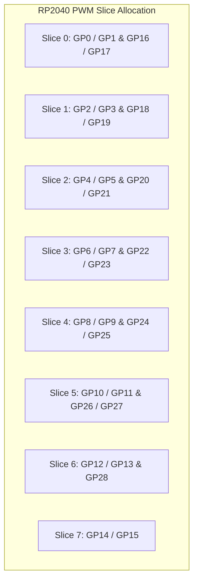

# Pin Assignment & Hardware Safeguards

Assigning GPIO pins correctly prevents hardware boot failures, signal distortion, and unrecoverable microcontroller crashes. This chapter documents electrical rules and architecture-specific pin restrictions.

---

## 1. ESP32 & ESP32-S3 Strapping Pin Hazards

Espressif microcontrollers sample specific "strapping pins" during power-on reset to determine boot mode (UART download vs SPI flash boot), flash voltage (3.3V vs 1.8V), and JTAG enable. 

> [!CAUTION]
> **DO NOT** connect motor encoders, pull-down switches, or motor driver inputs to strapping pins. If an encoder stops in a low state, pulling a strapping pin LOW at power-on, the ESP32 will hang in download mode or brownout on boot!

### ESP32 (NodeMCU-32S) Pin Restrictions

| GPIO Pin | Pin Type / Restriction | Safe Usage |
| :--- | :--- | :--- |
| **GPIO 0** | Strapping Pin (LOW = UART Flashing, HIGH = Normal Boot) | Pull HIGH with 10kΩ resistor. Avoid as encoder pin. |
| **GPIO 2** | Strapping Pin (Must be LOW/Floating during boot) | Internal LED. Avoid for motor drivers. |
| **GPIO 12 (MTDI)** | Strapping Pin (Flash Voltage: HIGH = 1.8V, LOW = 3.3V) | **DANGER**: Pulling HIGH burns 3.3V flash chips! Avoid entirely. |
| **GPIO 15 (MTDO)** | Strapping Pin (Enables debug output) | Avoid as encoder input. |
| **GPIO 34, 35, 36, 39** | **Input-Only Pins** (No internal pull-ups/pull-downs, no output drivers) | ✅ Excellent for ADC battery voltage or encoder inputs. ❌ Cannot output PWM! |
| **GPIO 6 – 11** | Connected internally to SPI Flash Memory | **STRICTLY FORBIDDEN**: Using these crashes the CPU immediately. |

---

## 2. Raspberry Pi Pico & Pico 2 (RP2040 / RP2350) Pin Rules

All 30 standard GPIO pins on RP2040 / RP2350 support hardware external interrupts and flexible PIO multiplexing. However, assigning peripherals must respect hardware PWM slice allocations.



### Pico Best Practices:
1. **I2C Bus Selection**:
   - `I2C0`: Default SDA = **GP4**, SCL = **GP5** (or GP8/GP9)
   - `I2C1`: Default SDA = **GP6**, SCL = **GP7** (or GP14/GP15)
2. **Encoder Inputs**:
   - RP2040 handles quadrature encoders efficiently across any standard GPIO via the included `rp2040-encoder-library`.
3. **PWM Frequency Allocation**:
   - Set motor PWM frequencies to **20,000 Hz (20 kHz)** to eliminate audible electromagnetic motor squeal.

---

## 3. Mandatory I2C Bus Pull-Up Resistors

```mermaid
circuit
    subgraph I2C_Bus ["I2C Bus Topology (3.3V Logic)"]
        VCC33["3.3V Power Rail"]
        R1["4.7 kΩ Pull-up"]
        R2["4.7 kΩ Pull-up"]
        VCC33 --- R1 --- SDA["SDA Line (e.g. GPIO 21 / GP4)"]
        VCC33 --- R2 --- SCL["SCL Line (e.g. GPIO 22 / GP5)"]
        SDA --- IMU_SDA["IMU: MPU6050 / BNO085"]
        SCL --- IMU_SCL["IMU SCL"]
        SDA --- MAG_SDA["Magnetometer: QMC5883L"]
        SCL --- MAG_SCL["Magnetometer SCL"]
    end
```

> [!IMPORTANT]
> Internal MCU pull-ups (typically 40kΩ–100kΩ) are **too weak** for high-speed I2C (400 kHz) over jumper wires. Always ensure your sensor breakout boards include 4.7kΩ pull-up resistors to 3.3V to prevent I2C bus lockup (`i2cdetect` timeout).
