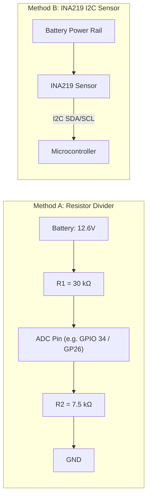

# Sensors & Actuators Integration

This guide details configuring IMUs, magnetometers, battery voltage monitors, ultrasonic range sensors, and auxiliary PWM expanders in Linorobot2.

---

## 1. Supported Inertial Measurement Units (IMUs)

Select your IMU in `config/custom/<robot_name>_config.h`:

```cpp
// Choose ONE IMU driver macro:
#define USE_MPU6050_IMU      // MPU6050 6-DOF (Default I2C Addr: 0x68)
// #define USE_BNO085_IMU    // BNO085 9-DOF with internal sensor fusion (Addr: 0x4A)
// #define USE_QMI8658_IMU   // QMI8658 6-DOF (Waveshare General Driver, Addr: 0x6B)
// #define USE_MPU9250_IMU   // MPU9250 9-DOF (MPU6500 + AK8963, Addr: 0x68)
```

### IMU Sensor Comparison

| Sensor | Degrees of Freedom | Sensor Fusion | Interface | Best Suited For |
| :--- | :---: | :---: | :---: | :--- |
| **MPU6050** | 6 (Accel + Gyro) | Host EKF (`robot_localization`) | I2C (0x68) | **Most Popular Starter IMU** |
| **BNO085** | 9 (Accel + Gyro + Mag) | On-Chip Hillcrest SensorHub | I2C (0x4A / 0x4B) | **High Accuracy Absolute Heading** |
| **QMI8658** | 6 (Accel + Gyro) | Host EKF | I2C (0x6B) | Integrated on Waveshare Driver Boards |
| **MPU9250** | 9 (Accel + Gyro + Mag) | Host EKF | I2C (0x68) | Legacy 9-DOF platform |

---

## 2. Magnetometers & Calibration (`MAG_BIAS`)

For outdoor navigation or high-accuracy indoor heading estimation, pair an external magnetometer:

```cpp
#define USE_QMC5883L_MAG     // QMC5883L 3-Axis Compass (I2C Addr: 0x0D)
// #define USE_AK09918_MAG   // AK09918 (I2C Addr: 0x0C)
// #define USE_HMC5883L_MAG   // Honeywell HMC5883L (I2C Addr: 0x1E)

// Hard-iron calibration offset in microteslas (uT)
#define MAG_BIAS { 12.5, -4.2, 8.7 }
```

---

## 3. Battery Monitoring (`sensor_msgs/BatteryState`)

Linorobot2 supports two methods for battery monitoring, publishing to the standard `/battery` topic:



### Configuration:
```cpp
// Option A: Analog ADC Divider
#define USE_BATTERY_MONITOR
#define BATTERY_PIN 34               // ADC Input Pin
#define BATTERY_R1 30000.0           // Top resistor (30 kΩ)
#define BATTERY_R2 7500.0            // Bottom resistor (7.5 kΩ)
#define BATTERY_DIP 0.2              // Voltage drop compensation

// Option B: INA219 Precision I2C Monitor
#define USE_INA219
#define INA219_ADDR 0x40
```

---

## 4. Ultrasonic Sonar Range Sensors (`sensor_msgs/Range`)

Attach HC-SR04 or US-100 ultrasonic distance sensors for close-proximity obstacle avoidance:

```cpp
#define USE_SONAR
#define SONAR_TRIGGER_PIN 18
#define SONAR_ECHO_PIN    19
#define SONAR_MAX_DISTANCE 2.0       // Maximum detection range in meters
```

---

## 5. 16-Channel PWM Servo Expander (PCA9685)

For pan/tilt camera gimbals, robotic arms, or auxiliary lighting:

```cpp
#define USE_PCA9685
#define PCA9685_ADDR 0x40
#define PCA9685_FREQ 50              // 50 Hz for standard analog/digital servos
```
