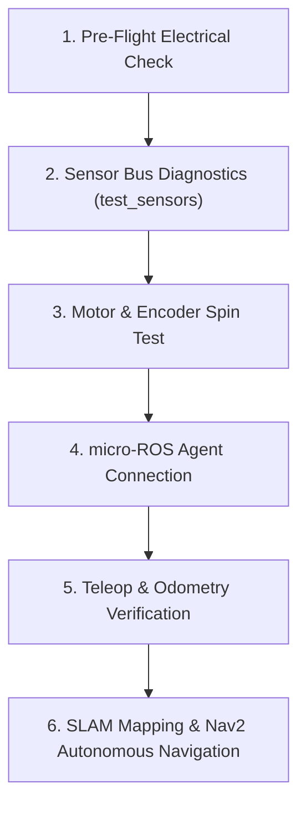

# Step-by-Step Hardware Bringup & Verification

Follow this ordered checklist when assembling and testing a new Linorobot2 platform to catch wiring errors and sensor issues early.

---

## Bringup Workflow Overview



---

## Step 1: Pre-Flight Electrical Inspection
1. **Common Ground**: Ensure the battery ground, motor driver ground, MCU ground, and sensor ground are all tied together to a solid star-ground point.
2. **Logic Voltage Levels**: Verify sensor breakout boards receive 3.3V logic. Connecting 5V directly to ESP32 or Pico GPIO pins will permanently destroy the microcontroller.
3. **Power Isolation**: Never power high-current DC motors directly from the microcontroller 3.3V or 5V regulator. Use a dedicated DC-DC step-down buck converter (e.g. 12V to 5V 3A) for the MCU and sensors.

---

## Step 2: Sensor Bus Diagnostics (`test_sensors`)

Before running full ROS 2 navigation, flash the standalone `test_sensors` firmware to test I2C communication and sensor health:

```bash
cd linorobot2_hardware/test_sensors
pio run -e pico -t upload
pio device monitor -b 115200
```

### Expected Output:
```
Scanning I2C bus...
 - 0x68 (MPU6050 IMU found)
 - 0x0D (QMC5883L Magnetometer found)
 - 0x40 (INA219 Battery Monitor found)

ACC  0.02  0.01  9.81 GYR  0.00  0.00  0.00 MAG  14.2 -3.1  8.5 BAT 12.42V RANGE 0.85m
```
- **Accelerometer $Z$**: Should read $\approx +9.81\text{ m/s}^2$ when sitting flat on a table.
- **Gyroscope**: Should read $\approx 0.00\text{ rad/s}$ when stationary.

---

## Step 3: Motor & Encoder Direction Verification

1. Elevate the robot on a stand so all drive wheels spin freely above the ground.
2. Slowly turn the wheels forward by hand and verify encoder values increment in the positive direction:
   ```bash
   ros2 topic echo /odom/unfiltered
   ```
3. If a wheel reports negative velocity when spun forward, flip `#define MOTORx_INV true` in your custom config header.

---

## Step 4: Full Robot Bringup & Teleop

Launch the complete Linorobot2 base driver and robot state publisher:

```bash
# Terminal 1: Launch micro-ROS agent (Serial)
ros2 run micro_ros_agent micro_ros_agent serial --dev /dev/ttyACM0 -b 115200

# Terminal 2: Launch Linorobot2 Bringup
ros2 launch linorobot2_bringup bringup.launch.py

# Terminal 3: Drive robot with keyboard teleop
ros2 run teleop_twist_keyboard teleop_twist_keyboard
```

---

## Step 5: SLAM Mapping & Autonomous Navigation

Once odometry and IMU fusion are verified:

```bash
# Launch SLAM Toolbox
ros2 launch linorobot2_navigation slam.launch.py

# Save generated map
ros2 run nav2_map_server map_saver_cli -f ~/my_map

# Launch Nav2 Autonomous Navigation
ros2 launch linorobot2_navigation navigation.launch.py map:=$HOME/my_map.yaml
```
