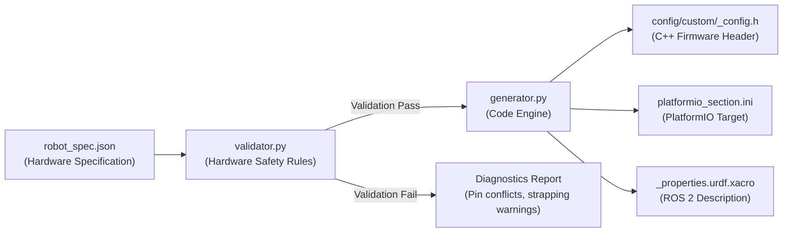

# AI Robot Configuration Engine Tutorial

The **Linorobot2 Robot Configuration Engine** (`tools/robot_config_engine/`) is an automated hardware rule validation and code generation tool. It transforms high-level robot hardware specifications into production-ready C++ firmware headers, PlatformIO build environments, and ROS 2 URDF Xacro descriptions while guarding against common electrical and microcontroller-specific hazards.

---

## 1. Why Use the Configuration Engine?

Configuring a mobile robot manually often leads to subtle hardware and software bugs:
- **ESP32 Strapping Pin Conflicts**: Connecting encoders to GPIO 0, 2, 12, 14, or 15 can pull pins LOW during power-on reset, causing the microcontroller to hang in UART bootloader mode or brown out.
- **Input-Only Pins**: Assigning ESP32 GPIO 34–39 to motor PWM or direction outputs results in silent motor driver failures because these pins lack output drivers.
- **RP2040 ADC Bounds**: Assigning non-ADC pins (outside GP26–GP29) for battery voltage divider monitoring.
- **Physical Mismatches**: Inaccuracies in wheel diameter, encoder CPR, and track width that cause odometry drift and Nav2 path-following oscillations.
- **Manual Repetition**: Having to manually write `<robot>_config.h`, `platformio.ini`, and `urdf/<robot>_properties.urdf.xacro` separately.

---

## 2. Configuration Engine Architecture



---

## 3. Step-by-Step Tutorial

### Step 1: Create Your Robot Specification (`my_robot.json`)

Create a JSON file describing your robot hardware. 

#### Example: Raspberry Pi Pico 2 Differential Drive with BTS7960 (`scout_pico2.json`)
```json
{
  "robot_name": "scout_pico2",
  "kinematics": "DIFFERENTIAL_DRIVE",
  "mcu": "PICO2",
  "transport": "SERIAL",
  "geometry": {
    "wheel_diameter": 0.080,
    "track_width": 0.220
  },
  "motors": {
    "driver_type": "BTS7960",
    "max_rpm": 400,
    "cpr": 1440,
    "operating_voltage": 12.0,
    "max_voltage": 12.0,
    "pwm_frequency": 20000,
    "motor1_inv": false,
    "motor2_inv": true
  },
  "sensors": {
    "imu": "BNO085",
    "mag": "NONE",
    "battery_monitor": "ADC_DIVIDER",
    "sonar": true
  },
  "pins": {
    "led": 25,
    "motor1": { "pwm_r": 14, "pwm_l": 15, "en": 13 },
    "motor2": { "pwm_r": 16, "pwm_l": 17, "en": 12 },
    "encoders": { "m1_a": 2, "m1_b": 3, "m2_a": 4, "m2_b": 5 },
    "i2c": { "sda": 8, "scl": 9 },
    "battery_pin": 26,
    "sonar": { "trig": 18, "echo": 19 }
  }
}
```

---

### Step 2: Validate and Generate Code

Run `generate_config.py` with your specification file:

```bash
python3 tools/robot_config_engine/generate_config.py scout_pico2.json --out-dir ./output/
```

#### CLI Output:
```
==========================================
 Validating: scout_pico2
==========================================

✅ Hardware rule validation PASSED!

Kinematics & Performance Summary:
 - Wheel Circumference: 0.2513 m
 - Max Linear Velocity (85% headroom): 1.424 m/s (5.13 km/h)
 - Max Angular Velocity: 12.947 rad/s (741.8 deg/s)
 - Ticks Per Meter: 5729.6 ticks/m

Generated Artifacts in './output/':
 1. C++ Header: ./output/scout_pico2_config.h
 2. PlatformIO Env: ./output/platformio_section.ini
 3. URDF Description: ./output/scout_pico2_properties.urdf.xacro
```

---

### Step 3: Deploy Generated Artifacts

1. **Deploy C++ Configuration Header**:
   ```bash
   cp output/scout_pico2_config.h linorobot2_hardware/config/custom/
   ```
2. **Register in `linorobot2_hardware/config/config.h`**:
   Add before `#endif`:
   ```cpp
   #ifdef USE_SCOUT_PICO2_CONFIG
       #include "custom/scout_pico2_config.h"
   #endif
   ```
3. **Add Target Environment to `firmware/platformio.ini`**:
   Append the content of `output/platformio_section.ini` to `firmware/platformio.ini`:
   ```ini
   [env:scout_pico2]
   platform = https://github.com/maxgerhardt/platform-raspberrypi.git
   board = rpipico2
   board_build.core = earlephilhower
   board_build.filesystem_size = 0.5m
   build_flags =
       -I ../config
       -D PICO
       -D USE_SCOUT_PICO2_CONFIG
   ```
4. **Deploy URDF Properties**:
   ```bash
   cp output/scout_pico2_properties.urdf.xacro linorobot2_description/urdf/robots/
   ```

---

### Step 4: Build & Flash Firmware

```bash
cd linorobot2_hardware/firmware
pio run -e scout_pico2 -t upload
```

---

## 4. AI Prompt Template (Natural Language to Robot Spec)

You can use the following prompt with any LLM (Antigravity, ChatGPT, Claude, or local Ollama `gemma4:31b` / `gpt-oss:120b`) to convert your robot hardware parts list directly into a validated `robot_spec.json`:

```text
You are a Linorobot2 hardware configuration assistant. Generate a valid JSON specification matching the schema for the following robot:

Robot Description:
- Name: rover_bot
- Microcontroller: Raspberry Pi Pico 2
- Kinematics: 2WD Differential Drive
- Wheel Diameter: 65 mm, Track Width: 200 mm
- Motors: 12V 330 RPM DC motors with 1320 CPR optical encoders
- Driver: Generic 2-IN (TB6612 / L298N)
- Pins:
  * Motor 1 (Left): PWM GP14, IN_A GP12, IN_B GP13
  * Motor 2 (Right): PWM GP15, IN_A GP10, IN_B GP11
  * Encoders: Left GP2/GP3, Right GP4/GP5
  * I2C: SDA GP8, SCL GP9
  * IMU: MPU6050
  * Battery: ADC divider on GP26
  * LED: GP25

Output ONLY the JSON object.
```

---

## 5. Hardware Safety Rules Reference Table

| Check Type | Severity | Target MCU | Rule Description |
| :--- | :---: | :---: | :--- |
| **Strapping Pin** | `WARNING` | ESP32 | Flagged if GPIO 0, 2, 12, 14, 15 are used for encoders (risk of boot failure). |
| **Input-Only Pin** | `ERROR` | ESP32 | Fails if GPIO 34, 35, 36, 39 are assigned as PWM or direction outputs. |
| **Flash SPI Pin** | `ERROR` | ESP32 | Fails if internal flash memory pins GPIO 6–11 are used. |
| **ADC Pin Bounds** | `ERROR` | RP2040/RP2350 | Fails if battery monitor is assigned to pins other than GP26, GP27, GP28, GP29. |
| **Duplicate Pin** | `ERROR` | All | Fails if any single GPIO pin is allocated to multiple functions. |
| **PID Headroom** | `INFO` | All | Calculates max speed with 85% rated RPM margin (`MAX_RPM_RATIO = 0.85`). |
