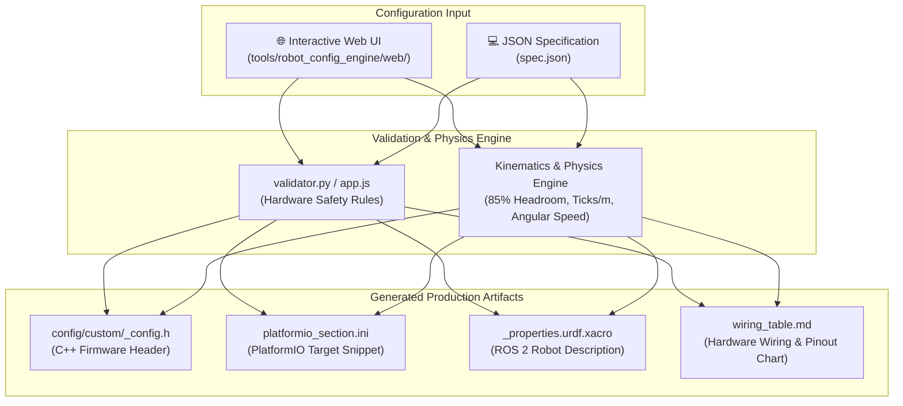

# AI Robot Configuration Engine Tutorial

The **Linorobot2 Robot Configuration Engine** (`tools/robot_config_engine/`) is an automated hardware rule validation, kinematics calculation, and multi-artifact code generation system. It eliminates manual C++ configuration errors, visually detects electrical and microcontroller hazards, and generates production-ready firmware headers, PlatformIO build targets, and ROS 2 URDF descriptions.

The Configuration Engine provides two complementary workflows:
1. **🌐 Interactive Web UI**: A 100% client-side, zero-dependency visual configurator with real-time physics HUD and safety inspector.
2. **💻 Python CLI Engine**: A scriptable JSON validator and code generator for terminal power users and CI/CD pipelines.

---

## 1. Why Use the Configuration Engine?

Configuring a custom mobile robot manually often leads to subtle hardware and software bugs:
- **ESP32 Boot Strapping Pin Conflicts**: Connecting encoders to `GPIO 0, 2, 12, 14, or 15` can pull pins LOW during power-on reset, causing the microcontroller to hang in UART bootloader mode or brown out.
- **Input-Only Pins**: Assigning ESP32 `GPIO 34–39` to motor PWM, direction, or sonar trigger outputs results in silent motor failures because these pins lack internal output drivers.
- **RP2040 ADC Bounds**: Assigning non-ADC pins (outside `GP26–GP29`) for battery voltage divider monitoring.
- **Physical Mismatches**: Inaccuracies in wheel diameter, encoder CPR, and track width that cause odometry drift and Nav2 path-following oscillations.
- **Manual Repetition**: Having to manually write `<robot>_config.h`, `platformio.ini`, and `urdf/<robot>_properties.urdf.xacro` separately.

---

## 2. Configuration Engine Architecture



---

## 3. Option A: Interactive Web UI (Visual Configurator)

The Configuration Engine includes a modern, dark-theme **100% client-side Web Application** located in `tools/robot_config_engine/web/`. It runs completely in the user's browser with zero external dependencies.

```
linorobot2_hardware/tools/robot_config_engine/web/
├── index.html   # Main HTML5 application shell
├── style.css    # Modern dark glassmorphism stylesheet
└── app.js       # Client-side validation, kinematics math & code generators
```

### Quick Start (Launch Locally)
```bash
cd linorobot2_hardware/tools/robot_config_engine/web
python3 -m http.server 8000
# Open http://localhost:8000 in your browser
```
*(You can also double-click `index.html` to open it directly in any web browser).*

---

### Key Web UI Features

#### 1. Reference Build Preset Quick-Loader
Load pre-configured, battle-tested robot configurations with one click:
- ⚡ **Raspberry Pi Pico 2**: 2WD Differential Drive + BTS7960 Motor Driver + BNO085 IMU + Sonar + ADC Divider.
- ⚡ **ESP32 Mecanum**: 4WD Mecanum Drive + WiFi UDP micro-ROS Transport + BNO085 + INA219.
- ⚡ **ESP32-S3 Crawler**: 4WD Skid Steer + USB CDC Serial + MPU6050 + HC-SR04 Sonar.
- ⚡ **Waveshare General Driver Board**: ESP32 + Generic 2-IN Driver + QMI8658 + AK09918 Compass.

#### 2. Live Kinematics & Performance HUD
As you adjust wheel size, track width, or motor RPM, the HUD calculates and displays real-time metrics:
- **Max Linear Speed**: Factoring 85% PID headroom ($\text{Speed} = \frac{\pi \cdot D \cdot \text{RPM}}{60} \cdot 0.85$) in m/s and km/h.
- **Max Angular Velocity**: ($\omega = \frac{2 \cdot v_{\text{max}}}{W}$) in rad/s and deg/s.
- **Resolution (Ticks Per Meter)**: Wheel encoder ticks per meter traveled.
- **Wheel Circumference**: Exact rolling distance per single revolution.

#### 3. Real-Time Hardware & Electrical Safety Inspector
Instantly warns about electrical mistakes before you solder or compile:
- 🟢 **Passed**: All assigned GPIOs, timers, and electrical limits are verified conflict-free.
- 🔴 **Duplicate Pin Collision**: Alerts if any single GPIO is assigned to multiple functions (e.g. `GP14` for both LED and PWM).
- 🔴 **ESP32 Input-Only GPIOs**: Blocks using `GPIO 34–39` as motor PWM, direction, or trigger outputs.
- 🔴 **SPI Flash Memory Pins**: Strictly forbids using internal flash memory pins `GPIO 6–11`.
- ⚠️ **Boot Strapping Warning**: Alerts when encoder interrupt lines are connected to `GPIO 0, 2, 12, 15` on ESP32 or `0, 3, 45, 46` on ESP32-S3.
- 🔴 **Pico ADC Bounds**: Enforces battery divider connection exclusively to analog pins `GP26, GP27, GP28`.

#### 4. ⚡ Smart Auto-Assign Pinout Button
Click the **⚡ Smart Auto-Assign** button to automatically populate an optimal, verified, conflict-free pinout layout tailored to your selected microcontroller.

#### 5. Multi-Artifact Live Preview & Export
Live syntax-highlighted tabs for:
- `custom/<robot>_config.h` (C++ Firmware)
- `platformio_section.ini` (PlatformIO Environment)
- `<robot>_properties.urdf.xacro` (ROS 2 Description)
- `wiring_table.md` (Markdown wiring chart)
- `spec.json` (Specification file)

Buttons to **Copy to Clipboard**, **Download Individual Files**, or **Export Specification JSON**.

---

## 4. Option B: Python CLI Engine (Terminal & Automation)

For command-line users, headless servers, and CI/CD testing pipelines, the Python CLI tool provides identical validation and generation.

### Step 1: Create or Edit Specification (`my_robot.json`)

```json
{
  "robot_name": "scout_pico2",
  "kinematics": "DIFFERENTIAL_DRIVE",
  "mcu": "PICO2",
  "transport": "SERIAL",
  "geometry": {
    "wheel_diameter": 0.080,
    "track_width": 0.220
  },
  "motors": {
    "driver_type": "BTS7960",
    "max_rpm": 400,
    "cpr": 1440,
    "operating_voltage": 12.0,
    "max_voltage": 12.0,
    "pwm_frequency": 20000,
    "motor1_inv": false,
    "motor2_inv": true
  },
  "sensors": {
    "imu": "BNO085",
    "mag": "NONE",
    "battery_monitor": "ADC_DIVIDER",
    "sonar": true
  },
  "pins": {
    "led": 25,
    "motor1": { "pwm_r": 14, "pwm_l": 15, "en": 13 },
    "motor2": { "pwm_r": 16, "pwm_l": 17, "en": 12 },
    "encoders": { "m1_a": 2, "m1_b": 3, "m2_a": 4, "m2_b": 5 },
    "i2c": { "sda": 8, "scl": 9 },
    "battery_pin": 26,
    "sonar": { "trig": 18, "echo": 19 }
  }
}
```

---

### Step 2: Validate and Generate Code

Run `generate_config.py`:

```bash
python3 tools/robot_config_engine/generate_config.py examples/scout_pico2.json --out-dir ./output/
```

#### Output:
```text
==========================================
 Validating: scout_pico2
==========================================

✅ Hardware rule validation PASSED!

Kinematics & Performance Summary:
 - Wheel Circumference: 0.2513 m
 - Max Linear Velocity (85% headroom): 1.424 m/s (5.13 km/h)
 - Max Angular Velocity: 12.947 rad/s (741.8 deg/s)
 - Ticks Per Meter: 5729.6 ticks/m

Generated Artifacts in './output/':
 1. C++ Header: ./output/scout_pico2_config.h
 2. PlatformIO Env: ./output/platformio_section.ini
 3. URDF Description: ./output/scout_pico2_properties.urdf.xacro
```

---

### Step 3: Run Unit Test Suite

Verify that all validation rules, strapping checks, and pin conflict detectors are functioning correctly:

```bash
python3 -m unittest tools/robot_config_engine/test_config_engine.py
```

---

## 5. Deploying Generated Artifacts to Firmware & ROS 2

Whether generated via the **Web UI** or the **CLI Tool**, follow these 4 simple steps to integrate your new robot into the firmware:

### 1. Copy C++ Configuration Header
```bash
cp scout_pico2_config.h linorobot2_hardware/config/custom/
```

### 2. Register Header in `config/config.h`
Add your robot macro to `linorobot2_hardware/config/config.h`:
```cpp
#ifdef USE_SCOUT_PICO2_CONFIG
    #include "custom/scout_pico2_config.h"
#endif
```

### 3. Add Environment to `firmware/platformio.ini`
Append the generated snippet to `linorobot2_hardware/firmware/platformio.ini`:
```ini
[env:scout_pico2]
platform = https://github.com/maxgerhardt/platform-raspberrypi.git
board = rpipico2
board_build.core = earlephilhower
board_build.filesystem_size = 0.5m
build_flags =
    -I ../config
    -D PICO
    -D USE_SCOUT_PICO2_CONFIG
```

### 4. Deploy ROS 2 URDF Properties
Copy the geometry file to your description package:
```bash
cp scout_pico2_properties.urdf.xacro linorobot2_description/urdf/robots/
```

### 5. Build and Flash Firmware
```bash
cd linorobot2_hardware/firmware
pio run -e scout_pico2 -t upload
```

---

## 6. AI Prompt Template (Natural Language to Robot Spec)

You can use this prompt with any LLM (Antigravity, ChatGPT, Claude, or local Ollama `gemma4:31b` / `gpt-oss:120b`) to convert your hardware parts list into a validated JSON specification or paste it directly into the Web UI:

```text
You are a Linorobot2 hardware configuration assistant. Generate a valid JSON specification matching the schema for the following robot:

Robot Description:
- Name: scout_pico2
- Microcontroller: Raspberry Pi Pico 2 (RP2350)
- Kinematics: 2WD Differential Drive
- Wheel Diameter: 80 mm, Track Width: 220 mm
- Motors: 12V 400 RPM DC motors with 1440 CPR quadrature encoders
- Driver: BTS7960 (Dual PWM + Enable lines)
- Pins:
  * Motor 1 (Left): PWM_R GP14, PWM_L GP15, EN GP13
  * Motor 2 (Right): PWM_R GP16, PWM_L GP17, EN GP12
  * Encoders: Left GP2/GP3, Right GP4/GP5
  * I2C: SDA GP8, SCL GP9
  * IMU: BNO085
  * Battery: ADC divider on GP26
  * Sonar: Trig GP18, Echo GP19
  * LED: GP25

Output ONLY the JSON object.
```

---

## 7. Hardware Safety Rules Reference Table

| Check Type | Severity | Target MCU | Rule Description |
| :--- | :---: | :---: | :--- |
| **Duplicate Pin** | `ERROR` | All | Fails if any single GPIO pin is allocated to multiple functions. |
| **Input-Only Pin** | `ERROR` | ESP32 | Fails if GPIO 34, 35, 36, 39 are assigned as PWM or direction outputs. |
| **Flash SPI Pin** | `ERROR` | ESP32 | Fails if internal flash memory pins GPIO 6–11 are used. |
| **ADC Pin Bounds** | `ERROR` | RP2040/RP2350 | Fails if battery monitor is assigned to pins other than GP26, GP27, GP28, GP29. |
| **Strapping Pin** | `WARNING` | ESP32 | Flagged if GPIO 0, 2, 12, 14, 15 are used for encoders (risk of boot failure). |
| **S3 Strapping Pin**| `WARNING` | ESP32-S3 | Flagged if GPIO 0, 3, 45, 46 are used for encoders. |
| **PID Headroom** | `INFO` | All | Calculates max speed with 85% rated RPM margin (`MAX_RPM_RATIO = 0.85`). |

---

## 8. Navigation

* [[← Back to Linorobot2 Wiki Home|Home]]
* [[Recommended MCU|Home#recommended-mcu-for-beginners--pico2-pico]]
* [[Motor Drivers|Home#motor-driver-configuration--use_bts7960_motor_driver---recommended]]
* [[Supported Sensors|Home#supported-sensors]]
* [[I/O Pin Assignments|Home#io-pins-assignment]]
* [[Troubleshooting Guide|Home#troubleshooting-guide]]
